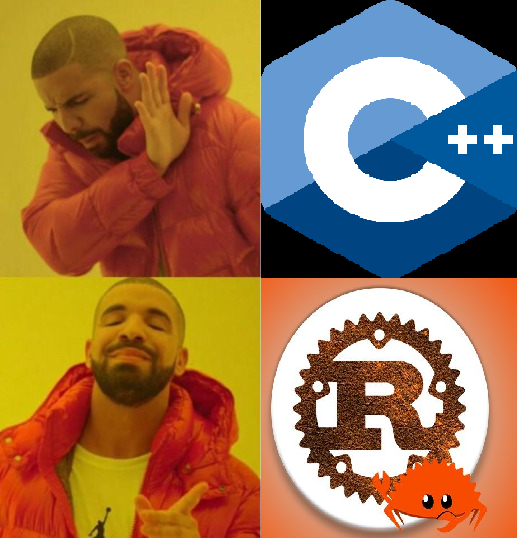

### Hey, I'm DuckEater (the 54th)

I'm just some guy interested in game development and is trying to understand Rust to do it. Yes I know that C++ and C are far better for the job but I have an irrational hatred and aversion towards them. I'm a fan of text-based environments with little GUI to look at.

Some things about me.

- I’m currently working on a 3d game made in rust.
- I’m currently learning Rust
- I’m looking to collaborate on Rust games using RG3D.
- I’m looking for help with game asset creation/development. Im bad at art and modelling and I cant be bothered practicing so I need somebody else to do it.
- Ask me about NOTHING! I probably wont be able to help you.
- How to reach me: ...
- Pronouns: He/Him
- Fun fact: I'm an idiot
